# Padel Management System

A Flutter portfolio prototype for padel-court discovery, booking interfaces, tournaments, player communication, and venue-owner dashboards.

[](https://github.com/noaman03/padel-management-system/releases/download/v1.0.0-demo.1/Padelit-v1.0.0-demo.1.apk)
[](https://github.com/noaman03/padel-management-system/releases/download/v1.0.0-demo.1/Padelit-Demo.mp4)

The APK is a debug-signed portfolio prerelease for side-loading and evaluation, not a production or Play Store build.

## Project Status

This project combines implemented Flutter interfaces, selected Firebase data paths, and local demonstration behavior. It is not a production booking system. Authentication, payments, chat, tournaments, and several owner workflows are simulated or only partially connected.

## Screenshots

Every screen ships in light and dark themes. The gallery covers player discovery, tournaments, matches, and chat together with venue-owner and administrator workflows.

| Light | Dark |
| :--: | :--: |
| 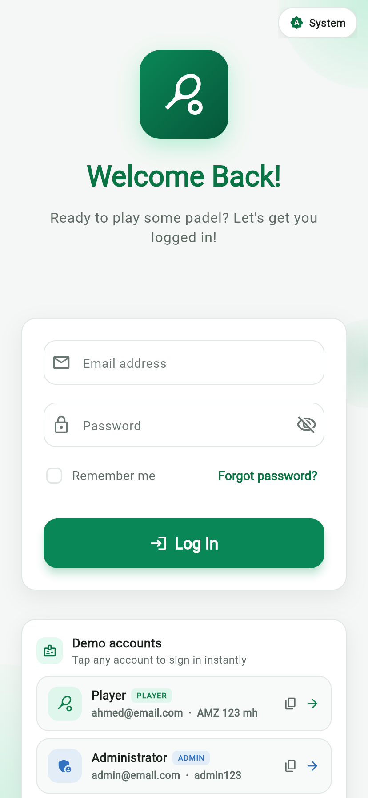 | 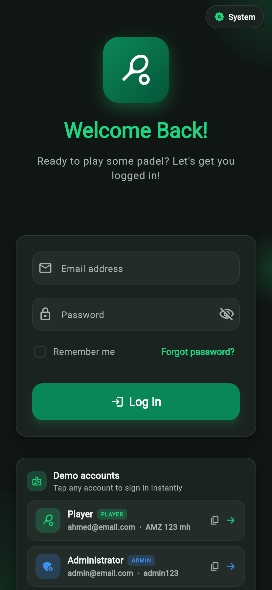 |
|  | 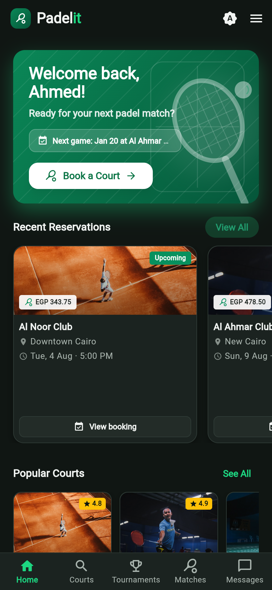 |
| 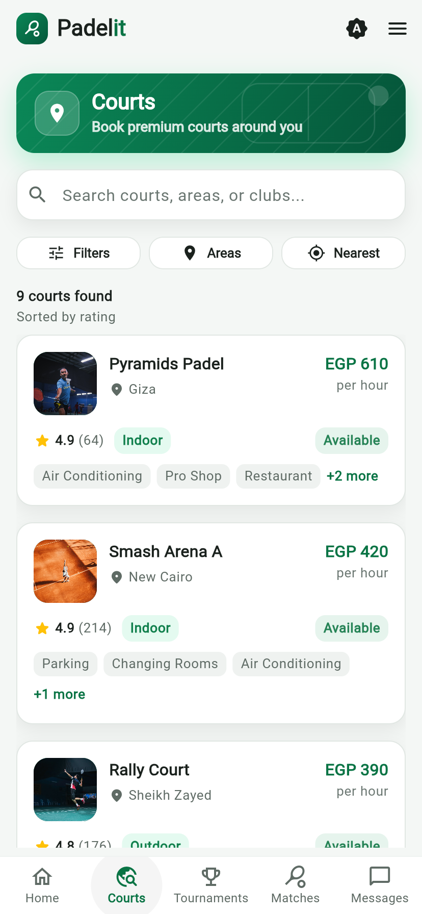 | 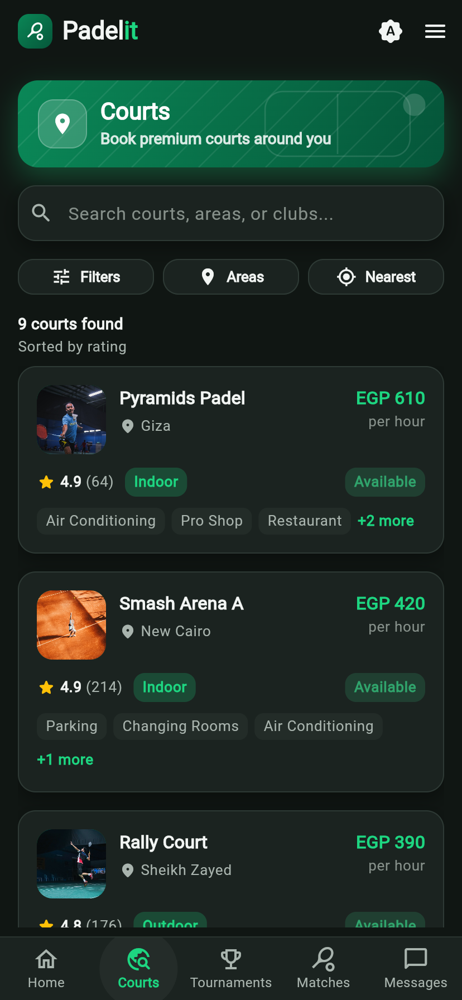 |
| 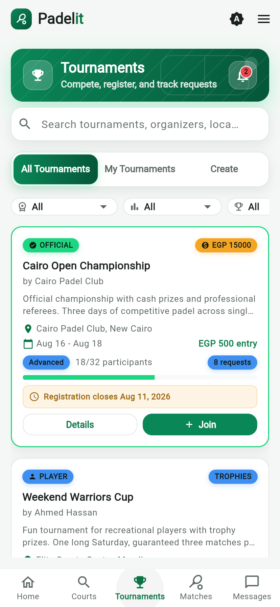 | 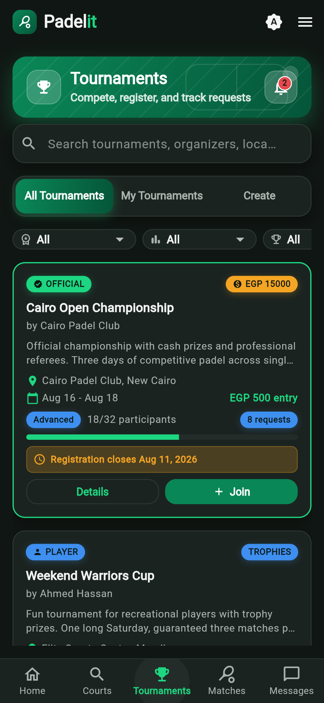 |
| 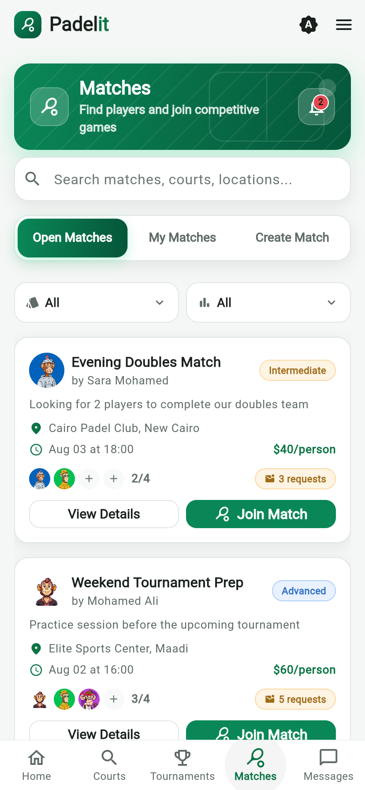 | 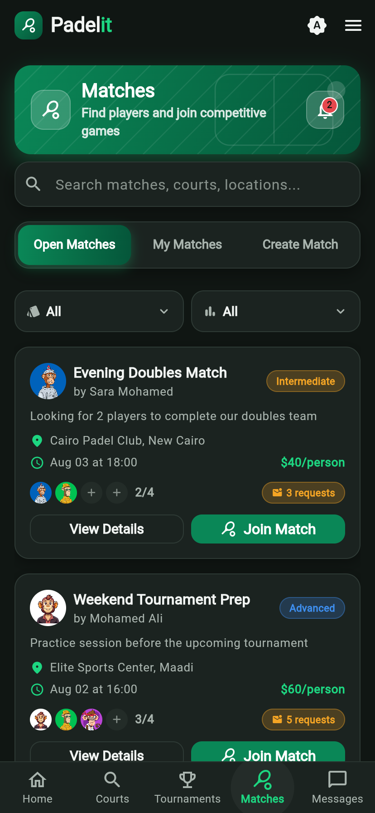 |
| 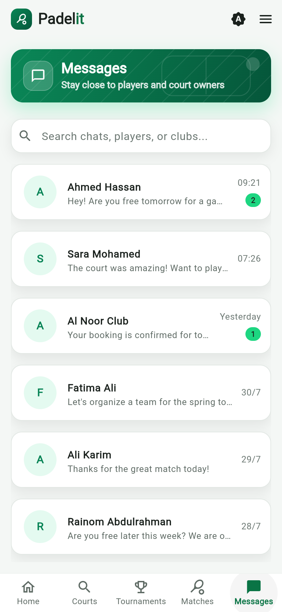 | 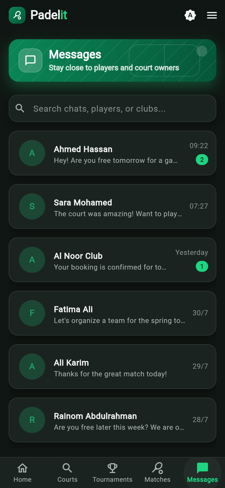 |
|  | 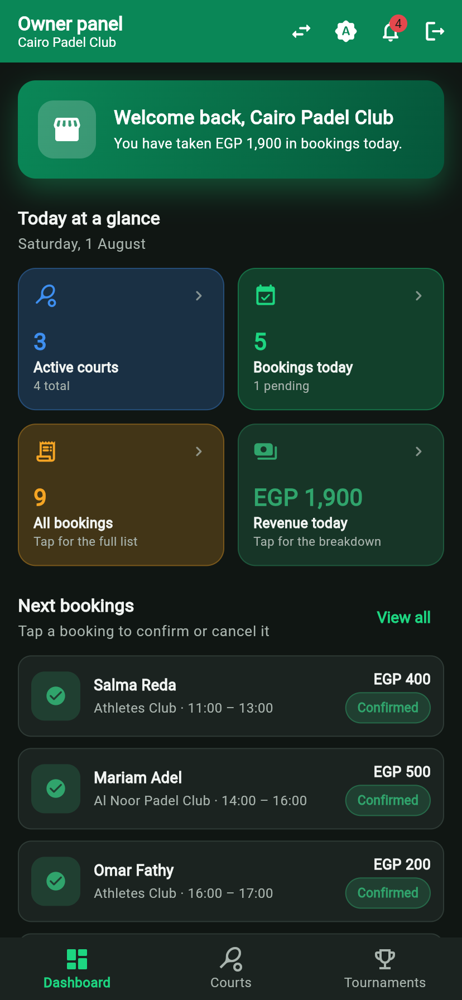 |
| 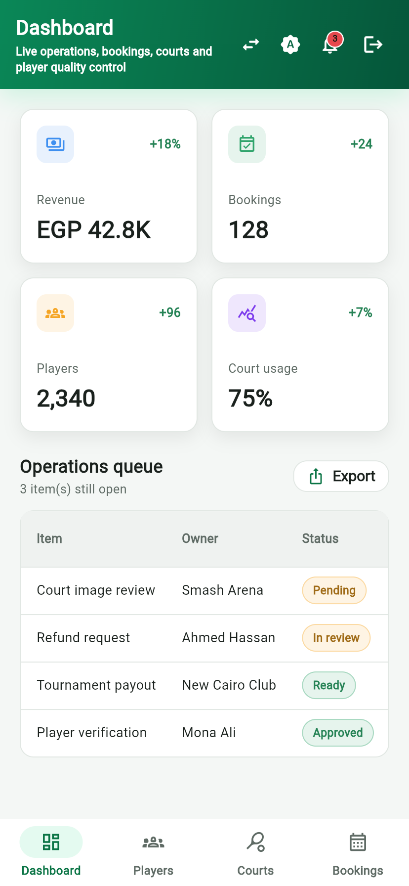 | 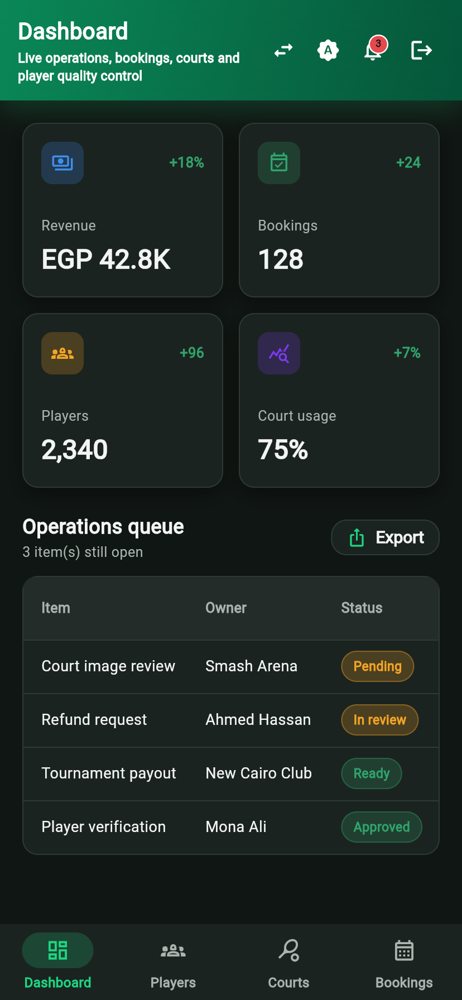 |

## Demo Authentication Warning

> The login screen offers one-tap demo accounts for the player, administrator, and court-owner roles. These are demonstration-only credentials hardcoded in the client and must never be used as real authentication.

A separate Firebase Authentication class and registration flow also exist, but the primary login path signs into the offline demo roles.

## Feature Status

| Area | Status | Verified behavior |
| --- | --- | --- |
| Player login | Simulated | The main controller accepts non-empty player credentials locally. |
| Owner login | Simulated | The hardcoded demonstration credentials open the owner dashboard. |
| Firebase registration | Partial | Email/password Firebase methods and role document writes exist separately from the main login path. |
| Court discovery | Implemented data path | `PadelCourtRepository` reads and searches court data from Cloud Firestore. |
| Court booking | Implemented data path | The court repository creates booking records and updates court statistics. |
| Checkout | Simulated | The UI waits locally and displays a successful payment result; no payment gateway is called. |
| Player chat | Session-persistent demo | A shared in-memory chat store keeps conversations, unread badges, sending, muting, and clearing consistent across screens during a session. |
| Tournaments and open matches | Session-persistent demo | Players browse, create, and join matches and tournaments with join-request handling backed by shared in-memory stores. |
| Owner court management | Session-persistent demo | Court and tournament editor screens create and update locally stored records during a session. |
| Owner dashboard | Demo/local state | Summary values and management sections are presentation-focused. |

## Player Experience

- Browse and search padel courts
- Open court details and availability interfaces
- Create reservation records through the Firestore repository path
- Review reservation, tournament, and open-match interfaces
- Use the session-persistent chat demonstration
- Create open matches, review join requests, and manage joined matches
- Switch between light and dark themes
- Review checkout and payment-method interfaces

## Owner Experience

- Open an owner dashboard
- Review court, booking, tournament, and management interfaces
- Add or edit locally represented courts and tournaments

Owner management screens should be treated as UI prototypes until their data operations are connected and tested.

## Technology Stack

- Flutter and Dart
- Material UI
- GetX for navigation and several controllers
- Riverpod through `ProviderScope` and provider-based features
- Firebase Core, Authentication, Cloud Firestore, and Storage packages
- Image picker and location packages

## Project Structure

```text
lib/
  core/                         Shared themes, routes, and services
  Features/
    auth/                       Login and registration interfaces
    players/
      courts/                   Court entities, repository, controllers, and screens
      checkout/                 Simulated checkout interface
      chat/                     Local demonstration conversations and messages
      tournaments/              Player tournament interfaces and local state
    owner/                      Owner dashboard and management interfaces
  Models/                       Shared presentation models
  Screens/                      Additional application screens
```

## Prerequisites

- Flutter SDK compatible with `pubspec.yaml`
- Android Studio or another Flutter-capable IDE
- Android device or emulator
- A Firebase project when testing the connected registration and court repository paths

## Firebase Configuration

1. Register an Android application in Firebase.
2. Enable Email/Password authentication if testing the Firebase registration service.
3. Create Cloud Firestore and Cloud Storage.
4. Replace `android/app/google-services.json` with your own Firebase client configuration.
5. Create and test security rules for the collections used by your deployment.

The repository does not include Firestore or Storage rules. An iOS runner exists, but no `GoogleService-Info.plist` is committed, so iOS Firebase setup is incomplete.

## Installation and Running

```bash
git clone https://github.com/noaman03/padel-management-system.git
cd padel-management-system
flutter pub get
flutter run
```

## Validation

```bash
flutter analyze
flutter test
```

These checks validate Flutter code only. Booking, Firebase, location, and payment behavior require integration testing with a configured test project.

## Localization and Sample Data

The interfaces use Egyptian names, locations, and EGP pricing in demonstration content. English and Arabic-facing text appears in the project, but a complete localization audit and production translation workflow were not found.

## Known Limitations

- The primary login path is not secure authentication.
- Payment processing is mocked.
- Chat, tournaments, open matches, and several owner workflows are not persisted.
- Firebase configuration is incomplete across platforms, and security rules are not committed.
- No automated integration or end-to-end tests were found for booking, authentication, or payment.
- Demonstration data must not be presented as live availability or completed transactions.

## Security

Remove the hardcoded owner credentials and connect every role to a verified authentication and authorization system before deployment. Review Firebase rules, validate all server-side permissions, and never commit service-account credentials or production user data.

## License

No software license has been selected. The absence of a license means reuse rights have not been granted.

## Contact

[Ahmed Noaman](https://github.com/noaman03) | [LinkedIn](https://www.linkedin.com/in/ahmed-noaman-07ab162b4)
